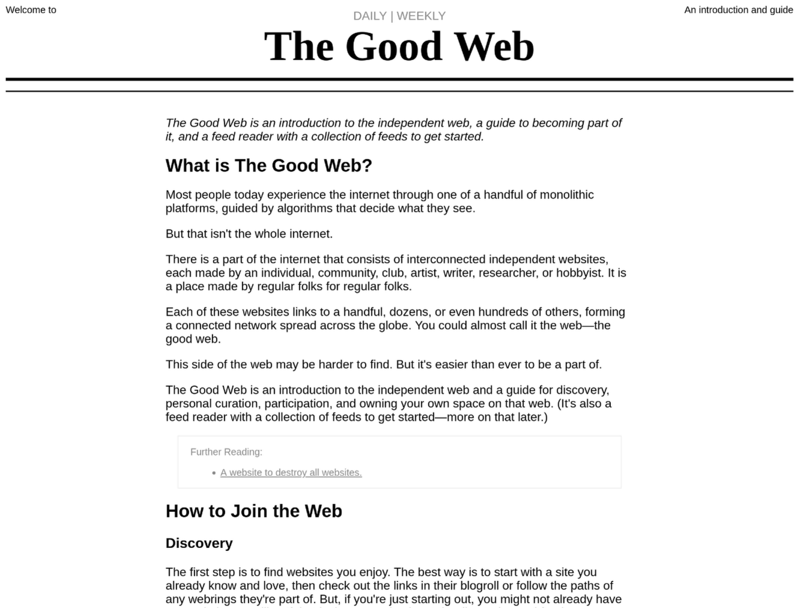

# The Good Web

*Welcome to the good web.*

The Good Web is an introduction to the independent web, a guide to becoming part of it, and a feed reader with a collection of feeds to get started.

<!--

## Philosophy

The web is more than a handful of social media platforms.

The Good Web encourages discovering independent websites, curating your own sources instead of relying on algorithms, participating in online communities, and creating a space of your own. The project aims to make the independent web easier to find and easier to join.

-->

## Details

### Introduction and Guide

TKTK

### Feed Reader and Feeds

TKTK

<!--

## Details

### Introduction and Guide

The homepage introduces the independent web and walks newcomers through discovering websites, curating their own collection of feeds, participating in online communities, and creating a website of their own. It is intended as a practical guide rather than a comprehensive history or manifesto.

### Feed Reader and Feeds

The Good Web also includes a static feed reader that aggregates a curated collection of RSS and Atom feeds into daily and weekly editions. The default feed collection focuses on personal websites, blogs, digital gardens, hobby projects, and other independently published content, but you can replace it with your own OPML file to create a feed reader tailored to your interests.

-->

## Usage

Visit [web.cobb.land](https://web.cobb.land) to use The Good Web.

- The homepage is the introduction and guide to the independent web
- Clicking "DAILY" in the heading will take you to the "The Good Web Daily" and "WEEKLY" to "The Good Web Weekly"
- Read, following links, explore, learn

<!--

## Usage

Visit https://web.cobb.land.

- Read the homepage for an introduction to the independent web.
- Browse the daily or weekly editions to discover new websites.
- Follow interesting links and subscribe to feeds you enjoy.
- Clone the project and replace the included OPML file with your own collection to build a personalized feed reader.

-->

## Development

- Clone repo
- Run `npm install`
- Optionally replace `data/feeds.opml` with your own collection of feeds
- Optionally set `weeklyEditionDay` in `scripts/goToPrint.js`
- Run `npm run fetch` to get feeds
- Deploy to static web host
- To update, run `npm run fetch`, then push to host

## Roadmap

- [ ] Further articulate opinions on "opinionated" page
- [ ] Make better default opml for introduction to the good web
- [ ] Add keyboard navigation

## Contribute

If you would like to contribute to this project, please fork and make a pull request. Also, if you have suggestions or find bugs, please feel free to open an issue.

## License

[GNU GENERAL PUBLIC LICENSE](LICENSE)

## Contact

[hello@jacobdensford.com](mailto:hello@jacobdensford.com)

## Acknowledgements

- TKTK
- TKTK
- TKTK
